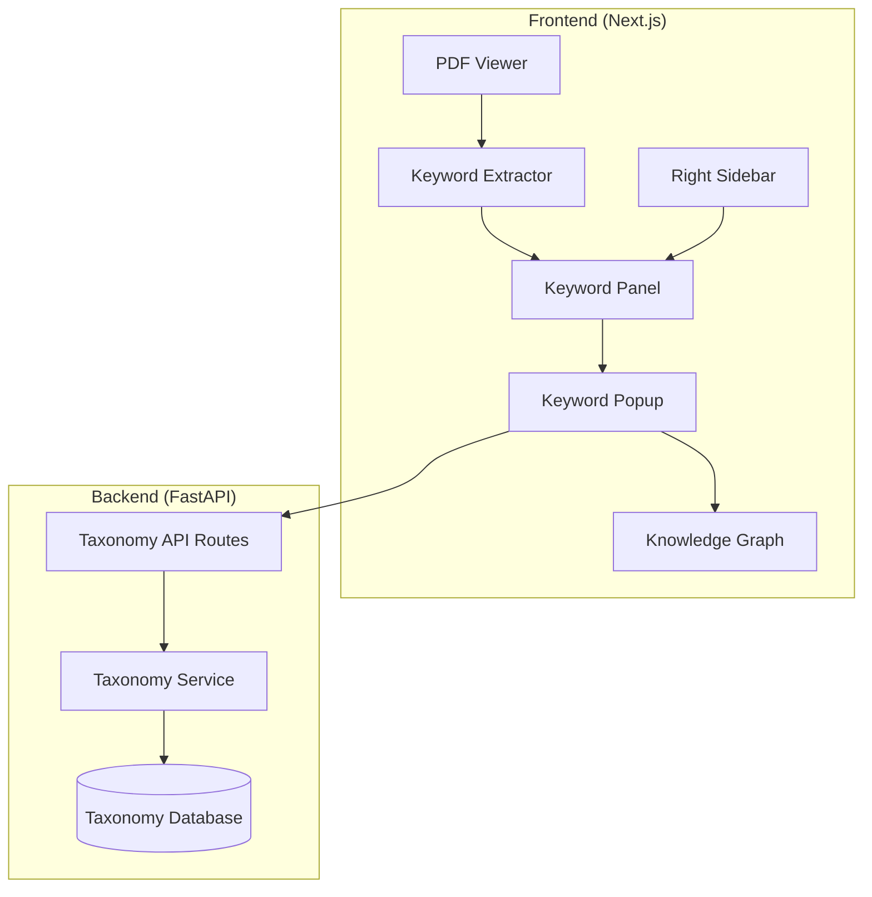

# Design Document: Keyword Explorer Integration

## Overview

This design integrates the keyword exploration functionality from the `keywordz-react` prototype into the main Paper Reader application. The integration adds a new "Keywords" tab to the right sidebar, enabling users to discover and explore technical keywords extracted from research papers with definitions, related concepts, and interactive knowledge graphs.

The implementation leverages the existing sidebar architecture and follows the established patterns for PDF processing and UI components in the Paper Reader codebase.

## Architecture



### Integration Points

1. **Right Sidebar**: Add new "Keywords" tab alongside existing Q&A, Highlights, Summary tabs
2. **PDF Viewer**: Hook into document load event to trigger keyword extraction
3. **Backend API**: New `/api/taxonomy` routes for concept lookup

## Components and Interfaces

### 1. KeywordExtractor Service

Extracts keywords from PDF text using predefined keyword lists and word-boundary matching.

```typescript
// lib/keyword-extractor.ts

export interface KeywordCategory {
  name: string;
  keywords: string[];
}

export interface ExtractedKeyword {
  keyword: string;
  count: number;
  category: string;
}

export interface ExtractionResult {
  keywords: ExtractedKeyword[];
  totalKeywords: number;
  numPages: number;
}

export const KEYWORD_CATEGORIES: KeywordCategory[] = [
  {
    name: 'Machine Learning',
    keywords: ['machine learning', 'deep learning', 'neural network', 'supervised learning', ...]
  },
  {
    name: 'Neural Architectures',
    keywords: ['transformer', 'attention mechanism', 'cnn', 'rnn', 'lstm', ...]
  },
  // ... other categories
];

export async function extractKeywordsFromPDF(pdfUrl: string): Promise<ExtractionResult>;
export function findKeywords(text: string, keywords?: string[]): Map<string, ExtractedKeyword>;
export function getCategoryForKeyword(keyword: string): string;
```

### 2. KeywordPanel Component

Displays extracted keywords grouped by category with occurrence counts.

```typescript
// components/keyword-panel.tsx

interface KeywordPanelProps {
  pdfUrl: string;
  documentId: string;
  onKeywordClick?: (keyword: ExtractedKeyword) => void;
}

interface KeywordPanelState {
  keywords: ExtractedKeyword[];
  loading: boolean;
  error: string | null;
  stats: {
    total: number;
    numPages: number;
  };
}
```

### 3. KeywordPopup Component

Displays keyword details, definition, and related concepts.

```typescript
// components/keyword-popup.tsx

interface KeywordPopupProps {
  isOpen: boolean;
  keyword: string;
  context: string;
  concept: ConceptData | null;
  siblings: RelatedConcept[];
  descendants: RelatedConcept[];
  loading: boolean;
  error: string | null;
  onClose: () => void;
  onNodeClick: (nodeId: string, nodeName: string) => void;
  position: { top: number; left: number };
}

interface ConceptData {
  id: string;
  name: string;
  definition: string;
  level?: number;
  ambiguous_with?: string[];
}

interface RelatedConcept {
  id: string;
  name: string;
}
```

### 4. MiniGraph Component

Interactive force-directed graph visualization using react-force-graph-2d.

```typescript
// components/mini-graph.tsx

interface MiniGraphProps {
  concept: ConceptData | null;
  siblings: RelatedConcept[];
  descendants: RelatedConcept[];
  onNodeClick: (nodeId: string, nodeName: string) => void;
}

interface GraphNode {
  id: string;
  name: string;
  type: 'central' | 'sibling' | 'descendant' | 'ambiguous';
  val: number;
}

interface GraphLink {
  source: string;
  target: string;
  type: 'sibling' | 'descendant' | 'ambiguous';
}
```

### 5. useKeywordExtraction Hook

React hook for managing keyword extraction state.

```typescript
// hooks/useKeywordExtraction.ts

interface UseKeywordExtractionReturn {
  keywords: ExtractedKeyword[];
  loading: boolean;
  error: string | null;
  stats: { total: number; numPages: number };
  extractKeywords: (pdfUrl: string) => Promise<void>;
  reset: () => void;
}

export function useKeywordExtraction(): UseKeywordExtractionReturn;
```

### 6. useTaxonomyAPI Hook

React hook for fetching concept data from the taxonomy API.

```typescript
// hooks/useTaxonomyAPI.ts

interface UseTaxonomyAPIReturn {
  fetchKeywordData: (keyword: string) => Promise<KeywordData>;
  fetchConceptById: (conceptId: string) => Promise<KeywordData>;
  loading: boolean;
  error: string | null;
}

interface KeywordData {
  concept: ConceptData | null;
  siblings: RelatedConcept[];
  descendants: RelatedConcept[];
  error: string | null;
}

export function useTaxonomyAPI(): UseTaxonomyAPIReturn;
```

### 7. Backend API Routes

```python
# backend/src/paperreader/api/taxonomy_routes.py

@router.get("/search")
async def search_concepts(query: str, limit: int = 5) -> SearchResponse:
    """Search for concepts by name."""
    pass

@router.get("/concepts/{concept_id}")
async def get_concept(concept_id: str) -> ConceptResponse:
    """Get concept details by ID."""
    pass

@router.get("/concepts/{concept_id}/siblings")
async def get_siblings(concept_id: str, limit: int = 10) -> SiblingsResponse:
    """Get sibling concepts."""
    pass

@router.get("/concepts/{concept_id}/descendants")
async def get_descendants(concept_id: str, max_nodes: int = 10) -> DescendantsResponse:
    """Get descendant concepts."""
    pass
```

## Data Models

### Keyword Extraction Models

```typescript
// Types for keyword extraction

interface ExtractedKeyword {
  keyword: string;      // Display name (title case)
  count: number;        // Number of occurrences
  category: string;     // Category name
}

interface ExtractionResult {
  keywords: ExtractedKeyword[];
  totalKeywords: number;  // Sum of all counts
  numPages: number;       // Pages processed
}
```

### Taxonomy API Models

```typescript
// Types for taxonomy API responses

interface ConceptData {
  id: string;
  name: string;
  definition: string;
  level?: number;
  ambiguous_with?: string[];
}

interface RelatedConcept {
  id: string;
  name: string;
}

interface SearchResponse {
  items: Array<{ id: string; name: string; score: number }>;
}

interface ConceptResponse extends ConceptData {}

interface SiblingsResponse {
  siblings: RelatedConcept[];
}

interface DescendantsResponse {
  descendants: RelatedConcept[];
}
```

## Correctness Properties

*A property is a characteristic or behavior that should hold true across all valid executions of a system—essentially, a formal statement about what the system should do. Properties serve as the bridge between human-readable specifications and machine-verifiable correctness guarantees.*

### Property 1: Keyword Extraction Completeness

*For any* PDF document with N pages, when keyword extraction completes, the extraction result SHALL contain text from all N pages and the numPages field SHALL equal N.

**Validates: Requirements 1.1**

### Property 2: Word Boundary Matching Accuracy

*For any* text containing a keyword K, the keyword extractor SHALL only match K when it appears as a complete word (bounded by word boundaries), not as a substring of another word.

**Validates: Requirements 1.2**

### Property 3: Keyword Categorization and Counting

*For any* keyword found in the text, it SHALL be assigned to exactly one category from the predefined categories, and the count SHALL equal the actual number of word-boundary matches in the text.

**Validates: Requirements 1.3, 1.4**

### Property 4: Singular/Plural Merging

*For any* keyword that has both singular and plural forms in the text (e.g., "neural network" and "neural networks"), they SHALL be merged into a single entry with the combined count of both forms.

**Validates: Requirements 1.5**

### Property 5: Keyword Panel Rendering

*For any* extraction result with keywords, the rendered Keyword Panel SHALL display all keywords grouped by their category, with each keyword showing its occurrence count, and statistics showing correct totals.

**Validates: Requirements 2.1, 2.2, 2.3**

### Property 6: Popup Content Rendering

*For any* keyword with associated concept data, the Keyword Popup SHALL display the keyword name, taxonomy level (if available), document occurrence count, and definition from the API.

**Validates: Requirements 3.2, 3.3, 3.4**

### Property 7: Related Concepts Display Limit

*For any* concept with related concepts, the Keyword Popup SHALL display at most 5 siblings, at most 5 descendants, and all ambiguous concepts as clickable tags.

**Validates: Requirements 4.1, 4.2, 4.3**

### Property 8: Knowledge Graph Node Rendering

*For any* concept with related concepts, the Knowledge Graph SHALL render the central concept as a node with distinct color, siblings as connected nodes with sibling color, descendants as connected nodes with descendant color, and ambiguous concepts (if any) as connected nodes with ambiguous color.

**Validates: Requirements 5.1, 5.2, 5.3, 5.4**

### Property 9: Document Switch State Reset

*For any* document switch event, the Keyword Panel SHALL clear all previous extraction results and initiate a new extraction for the new document.

**Validates: Requirements 6.5**

### Property 10: Taxonomy API Contract

*For any* valid search query, the Taxonomy API search endpoint SHALL return matching concepts. *For any* valid concept ID, the concept, siblings, and descendants endpoints SHALL return the appropriate data.

**Validates: Requirements 7.1, 7.2, 7.3, 7.4**

## Error Handling

### Frontend Error Handling

1. **PDF Text Extraction Failure**
   - Display error message in Keyword Panel
   - Log error details to console
   - Allow retry via refresh button

2. **Taxonomy API Failure**
   - Display fallback message in popup: "Unable to fetch definition"
   - Show keyword name and document context even without API data
   - Log error for debugging

3. **Graph Rendering Failure**
   - Display "No graph data available" message
   - Gracefully degrade to text-only related concepts

### Backend Error Handling

1. **Concept Not Found**
   - Return 404 with descriptive message
   - Frontend shows "Concept not found in taxonomy"

2. **Database Connection Failure**
   - Return 503 Service Unavailable
   - Frontend shows "Service temporarily unavailable"

## Testing Strategy

### Unit Tests

Unit tests verify specific examples and edge cases:

1. **Keyword Extractor Tests**
   - Test word boundary matching with edge cases (punctuation, hyphens)
   - Test singular/plural merging
   - Test category assignment
   - Test empty text handling

2. **Component Tests**
   - Test KeywordPanel renders loading state
   - Test KeywordPanel renders error state
   - Test KeywordPopup closes on Escape key
   - Test MiniGraph renders empty state

### Property-Based Tests

Property-based tests verify universal properties across many generated inputs. Each property test must run a minimum of 100 iterations.

**Testing Framework**: fast-check (TypeScript property-based testing library)

1. **Property Test: Word Boundary Matching**
   - Generate random text with embedded keywords
   - Verify only word-boundary matches are found
   - **Feature: keyword-explorer-integration, Property 2: Word Boundary Matching Accuracy**

2. **Property Test: Keyword Counting**
   - Generate text with known keyword counts
   - Verify extracted counts match expected
   - **Feature: keyword-explorer-integration, Property 3: Keyword Categorization and Counting**

3. **Property Test: Singular/Plural Merging**
   - Generate text with singular and plural forms
   - Verify merged count equals sum of both
   - **Feature: keyword-explorer-integration, Property 4: Singular/Plural Merging**

4. **Property Test: Related Concepts Limit**
   - Generate concept data with varying numbers of related concepts
   - Verify display limits are respected
   - **Feature: keyword-explorer-integration, Property 7: Related Concepts Display Limit**

5. **Property Test: Graph Node Rendering**
   - Generate concept data with various relationship types
   - Verify all nodes are rendered with correct types and colors
   - **Feature: keyword-explorer-integration, Property 8: Knowledge Graph Node Rendering**

### Integration Tests

1. **End-to-End Keyword Extraction Flow**
   - Load PDF → Extract keywords → Display in panel → Click keyword → Show popup

2. **Taxonomy API Integration**
   - Search concept → Get details → Get siblings → Get descendants

3. **Sidebar Integration**
   - Toggle Keywords tab → Verify panel displays → Switch documents → Verify reset
