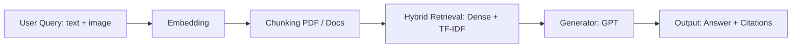
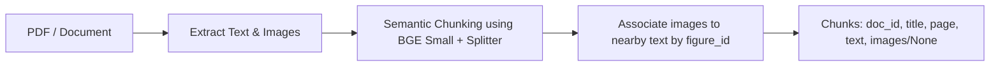

FastAPI backend for parsing and querying academic PDFs and QA RAG features.

# QA Overview

Overview of the QA flow and listing of models/techniques used.

## Overall Flow


## PDF Chunking and Image Extraction

Detailed description of how to chunk PDFs and attach images to chunks.

#### 1. Semantic Chunking

```python
_EMBED_MODEL = "BAAI/bge-small-en-v1.5"
_SPLITTER = SemanticSplitterNodeParser(
    buffer_size=1,
    breakpoint_percentile_threshold=95,
    embed_model=_EMBED_MODEL
)
```

* Split PDF/documents into semantic chunks based on embedding similarity.
* buffer_size=1 prevents information loss when splitting.
* breakpoint_percentile_threshold=95 favors splitting at clear semantic boundaries.

#### 2. Image Extraction

* The `extract_images` function scans Markdown syntax: `` in the text.
* Interpolates `figure_id` near the text chunk to identify which images are related to the text.

#### 3. Attach Images to Chunks

```python
chunks.append({
    "doc_id": doc_id,
    "title": title,
    "page": page,
    "text": chunk_text,
    "images": chunk_images if chunk_images else None
})

* If no related images → "images": None.
* If there are related images → "images" is a list of paths / metadata of the images.

---

#### 4. Flow Chunking + Image Association



## Multi-Modal Embedding using Visualized BGE

Describes how to create embeddings for **queries and chunks** using the Visualized BGE model for text + image retrieval.

#### 1. Prepare the Model

* Model: [BAAI/bge-visualized](https://huggingface.co/BAAI/bge-visualized)
* Two available weights: `bge-visualized-base-en-v1.5` and `bge-visualized-m3`
* Use `bge-visualized-m3` to support **multi-language**.

```python
import torch
from visual_bge.modeling import Visualized_BGE

# Load the model with the downloaded weight
model = Visualized_BGE(
    model_name_bge="BAAI/bge-base-en-v1.5",
    model_weight="path/to/bge-visualized-m3.pth"
)
model.eval()

#### 2. Create Embedding for Query

```python
with torch.no_grad():
    query_emb = model.encode(text="Are there sidewalks on both sides of the Mid-Hudson Bridge?")

* If only text is available, pass text.
* If both text and image are available, pass both text and the image path.

#### 3. Create Embedding for Candidate Chunks

```python
with torch.no_grad():
    candi_emb_1 = model.encode(
        text="The Mid-Hudson Bridge, spanning the Hudson River between Poughkeepsie and Highland.",
        image="./imgs/wiki_candi_1.jpg"
    )
    candi_emb_2 = model.encode(
        text="Golden_Gate_Bridge",
        image="./imgs/wiki_candi_2.jpg"
    )
    candi_emb_3 = model.encode(
        text="The Mid-Hudson Bridge was designated as a New York State Historic Civil Engineering Landmark by the American Society of Civil Engineers in 1983. The bridge was renamed the \"Franklin Delano Roosevelt Mid-Hudson Bridge\" in 1994."
    )
```

* encode supports text + optional image, enabling multi-modal retrieval.
* If a chunk only has text → pass text.
* If a chunk has both text and image → pass text + image.
* 
## Hybrid Search Flow

Detailed description of **Hybrid Search** in the retrieval pipeline.

#### 1. Processing Steps

1. **Keyword Generation**

   * Use GPT (e.g., `gpt-4`) to generate a list of keywords from the query.

2. **Keyword Search**

   * Retrieve chunks based on TF-IDF similarity with the generated keywords.

3. **Dense Search**

   * Encode the query (text + optional image) into a vector embedding.
   * Compute cosine similarity with the dense vectors of the chunks.

4. **Score Merging**

   * Combine scores: `score = alpha * dense_score + (1 - alpha) * keyword_score`
   * Rank and select the top-k chunks according to the merged score.
 - alpha) * keyword_score`
   * Sắp xếp và chọn top-k chunk theo merged score.

#### 2. Output

* List of **top-k relevant chunks** with:

  * `index` trong corpus
  * `score` (sau khi kết hợp)
  * `text` chunk
  * `metadata` (title, page, images...)
  
# API 
### System

- GET `/health`
  - Purpose: Simple health check.
  - Response: `{ status: "ok" }`

- GET `/`
  - Purpose: Root endpoint.
  - Response: `{ message: "Welcome to LOL PaperReader Backend 🚀" }`

---

### PDF

- POST `/api/pdf/upload-and-parse/`
  - Purpose: Upload one PDF, parse, copy outputs (markdown/images) into `data_dir`, then attempt to build the QA pipeline immediately.
  - Request: `multipart/form-data` with `file` (PDF)
  - Response example:
    - `{ status: "ok", outputs: { markdown_embedded: string, page_images: string[], figures: string[] } }`

- GET `/api/pdf/status`
  - Purpose: Check QA pipeline readiness and progress.
  - Request: none
  - Response example:
    - `{ building: boolean, ready: boolean, has_cache?: boolean, chunks?: number, error?: string }`

- POST `/api/pdf/save-and-parse/`
  - Purpose: Upload multiple PDFs, persist to `data_dir/uploads`, parse, copy outputs into `data_dir`, and build pipeline.
  - Request: `multipart/form-data` with `files` (array of PDFs)
  - Response example:
    - `{ status: "ok", count: number, results: [{ pdf: string, outputs: { ... } }] }`

- POST `/api/pdf/parse-uploads-folder/`
  - Purpose: Parse all PDFs already present in `data_dir/uploads` and (re)build the pipeline.
  - Request: none
  - Response example:
    - `{ status: "ok", count: number, results: [{ pdf: string, outputs: { ... } }] }`

---

### QA

- POST `/api/qa/ask`
  - Purpose: Ask a question using the QA pipeline (retriever + generator), optionally with user images.
  - Request (JSON):
    - `{ question: string, retriever?: "keyword"|"dense"|"hybrid", generator?: "openai"|"ollama"|"extractive", image_policy?: "none"|"auto"|"all", top_k?: number, max_tokens?: number, user_images?: string[] }`
  - Response (JSON):
    - `{ question: string, answer: string, cited_sections: any[], retriever_scores: any[] }`

- POST `/api/qa/ask-with-upload`
  - Purpose: Ask a question with image uploads (multipart/form-data).
  - Request: `question`, `retriever?`, `generator?`, `image_policy?`, `top_k?`, `max_tokens?`, `images?` (files)
  - Response: Same shape as `/api/qa/ask`

- POST `/api/qa/benchmark`
  - Purpose: Run a benchmark over a set of questions using a specified retriever/generator.
  - Request (JSON):
    - `{ questions: string[], retriever?: "keyword"|"dense"|"hybrid", generator?: "openai"|"ollama"|"extractive", top_k?: number }`
  - Response: Benchmark report (JSON)

---

### Chat

- POST `/api/chat/sessions`
  - Purpose: Create a new chat session (or return an existing one by title).
  - Request (JSON): `{ user_id?: string|null, title?: string, initial_message?: string|null }`
  - Response: `ChatSessionResponse` — `{ session_id, title, messages, created_at, updated_at, message_count }`

- GET `/api/chat/sessions`
  - Purpose: List chat sessions for a user.
  - Query: `user_id` (required), `limit?`
  - Response: `{ sessions: ChatSessionResponse[] }`

- GET `/api/chat/sessions/{session_id}`
  - Purpose: Retrieve a specific chat session by id.
  - Response: `ChatSessionResponse`

- DELETE `/api/chat/sessions/{session_id}`
  - Purpose: Delete a chat session by id.
  - Response: `{ message: "Session deleted successfully" }`

- PUT `/api/chat/sessions/{session_id}/title`
  - Purpose: Update the title of a chat session.
  - Request: `title` (simple param/body depending on client)
  - Response: `{ message: "Title updated successfully" }`

- POST `/api/chat/ask`
  - Purpose: Ask a question within a session; persists conversation; returns answer with citations and confidence.
  - Request (JSON):
    - `{ session_id: string, question: string, retriever?: string, generator?: string, image_policy?: string, top_k?: number, max_tokens?: number, user_images?: string[] }`
  - Response (JSON):
    - `{ session_id, question, answer, cited_sections: any[], retriever_scores: any[], message_id: string, timestamp: string, confidence?: number }`

- POST `/api/chat/ask-with-upload`
  - Purpose: Ask with image uploads in a session.
  - Request: multipart/form-data (`session_id`, `question`, optional params, `images?`)
  - Response: Same shape as `/api/chat/ask`

---

## Data Flow

### Request Flow

```
User Input
    ↓
QAInterface Component
    ↓
POST /api/chat/ask (Next.js API Route)
    ↓
POST /api/chat/ask (Backend FastAPI)
    ↓
ChatService.get_history(session_id)
    ↓
QAPipeline.answer(question, chat_history)
    ↓
Retriever.retrieve() → Generator.generate()
    ↓
Response
```

### Response Flow

```
QAPipeline Result
    ↓
{answer, cited_sections, confidence}
    ↓
ChatService.add_message() → MongoDB
    ↓
Backend API Response
    ↓
Next.js API Response
    ↓
QAInterface Update State
    ↓
localStorage Persistence
    ↓
UI Display
```

## Chat History

### Format
```python
[
  {
    "role": "user",
    "content": "What is the main finding?",
    "timestamp": "2024-01-01T00:00:00Z",
    "metadata": {}
  },
  {
    "role": "assistant",
    "content": "The main finding is...",
    "timestamp": "2024-01-01T00:00:01Z",
    "metadata": {
      "cited_sections": [...],
      "confidence": 0.89
    }
  }
]
```

